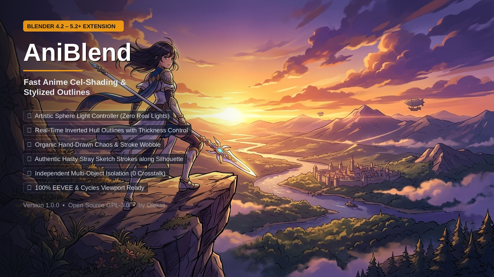
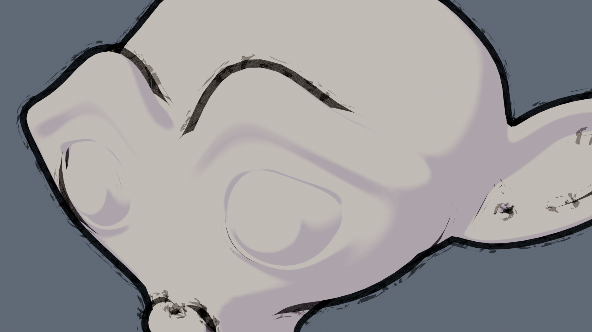

<p align="center">
  
</p>

<h1 align="center">🎨 AniBlend — Professional Anime & Manga Shading for Blender</h1>

<p align="center">
  <b>Transform any 3D model into high-quality 2D Anime & Manga artwork with interactive shadow controllers and procedural sketchy outlines.</b>
</p>

<p align="center">
  <a href="https://www.blender.org/"></a>
  <a href="LICENSE"></a>
  <a href="https://github.com/QFTIK/aniblend/releases"></a>
  <a href="https://extensions.blender.org/"></a>
</p>

---

## 🌟 Overview

**AniBlend** is a modern extension and add-on for **Blender 4.2 LTS through Blender 5.0+** designed for character artists, animators, and illustrators who need fast, customizable, production-ready non-photorealistic rendering (NPR).

Gone are the days of manual node-tree wiring and fiddling with inverted hull setups. AniBlend automates the entire process in one click, introducing an **interactive 3D light rotation controller sphere** and **stylized procedural outlines with organic hand-drawn jitter**.

<p align="center">
  
</p>

---

## ✨ Features

### 💡 Interactive Sphere Light Controller
- **Intuitive Shadow Steering**: Generates a dedicated wireframe controller sphere for each object. Simply select and rotate (`R`) to steer shadow directions instantly without moving real scene lights.
- **Multi-Object Isolation**: Each mesh can have its own independent shadow angle, or share a global light source.
- **Customizable Thresholds & Smoothness**: Dial from razor-sharp anime cel boundaries to soft watercolor gradients.

### ✒️ Procedural Anime Outlines with Hand-Drawn Chaos
- **Zero Grease Pencil Overhead**: Uses lightweight inverted-hull geometry compatible with all viewport shading modes and real-time EEVEE-Next rendering.
- **4 Outline Styles**:
  - `Solid`: Crisp, modern studio anime silhouette.
  - `Ink/Pen`: Dynamic pressure-sensitive comic ink.
  - `Dashed`: Stylized manga hatching strokes.
  - `Sketch`: Organic hand-drawn pencil feel.
- **Jitter & Chaos Engine**: Break the sterile 3D look with procedural stroke waviness and thickness fluctuations.
- **Secondary Stray Strokes**: Adds hasty pencil sketch marks floating near the silhouette for an authentic manga draft feel.

### 🎨 Instant Color Presets
- Switch color palettes instantly:
  - **Classic Cel**: Crisp Japanese anime standard.
  - **Ghibli Watercolor**: Warm, nostalgic soft tones.
  - **Warm Sunset**: Vibrant golden highlights with rich purple shadows.
  - **Cyberpunk**: Neon rim lights with deep high-contrast tones.

---

## 🚀 Installation

### Option 1: Modern Blender Extension (Recommended)
1. Open Blender **4.2 LTS or 5.0+**.
2. Go to **Edit** > **Preferences** > **Get Extensions**.
3. Click the menu dropdown at the top right > **Install from Disk...**
4. Select `aniblend-1.0.0.zip`.
5. AniBlend will appear in your 3D Viewport sidebar (`N`-panel under `AniBlend`).

### Option 2: Traditional Add-on (.zip)
1. Go to **Edit** > **Preferences** > **Add-ons**.
2. Click the gear icon / dropdown > **Install from Disk...**
3. Select `aniblend.zip`.
4. Enable the checkbox for **AniBlend**.

---

## 🛠️ Quick Start Guide

1. **Select your 3D model** in Object Mode.
2. Press `N` in the 3D Viewport to open the sidebar and navigate to the **AniBlend** tab.
3. Click **"Apply Anime Shader"**:
   - AniBlend sets up the custom node network and creates a wireframe controller sphere.
   - Press `R` to rotate the sphere and watch shadows track your angle in real time!
4. Click **"Add Outlines"**:
   - Inverted hull outlines appear immediately.
   - Adjust **Thickness**, **Chaos (Jitter)**, **Opacity**, and **Style** in the `Outlines` tab.

---

## 📁 Repository Structure

```
aniblend/
├── __init__.py               # Addon registration & extension lifecycle
├── operators.py              # Operators for applying shaders, outlines & presets
├── panels.py                 # Sidebar 3D viewport UI panels & property callbacks
├── shader_builder.py         # Mathematical node-tree generator & outline shaders
├── blender_manifest.toml     # Official Blender 4.2+ extension manifest
├── assets/                   # Store graphics, icons & preview renders
│   ├── aniblend_store_cover.jpg
│   ├── aniblend_icon.png
│   ├── aniblend_inengine_render.png
│   └── aniblend_cover_clean.jpg
├── LICENSE                   # GNU General Public License v3.0
└── README.md                 # Documentation
```

---

## 📄 License & Credits

AniBlend is open-source software licensed under the [GNU General Public License v3.0 (GPL-3.0)](LICENSE).

Developed with ❤️ for the Blender and Anime 3D Community.
