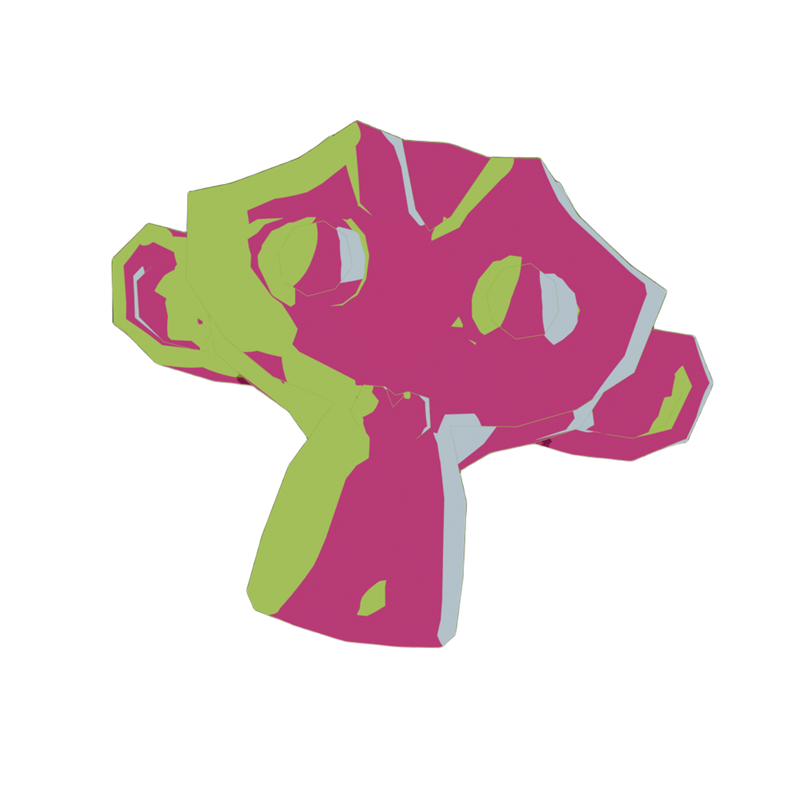

  

<h1 align="center">AniBlend</h1>

  <strong>Fast Anime Cel-Shading & Stylized Outlines for Blender 4.2+ & 5.0+</strong>

  
  
  

---

**AniBlend** is a high-performance Blender add-on and extension designed to give 3D models a production-ready Japanese anime cel-shaded look with customizable inverted-hull outlines, multi-light direction controllers, and intuitive layer blending — entirely within the EEVEE / Material Preview viewport.

---

## ✨ Key Features

### 🎨 Artistic Multi-Light System
- **Empty Sphere Controller (`R` to Rotate):** No need to fiddle with scene lamps or shadow cascades. Aim lighting and shadow borders interactively by rotating a sphere controller in the 3D viewport.
- **Color-Coded Pointer Indicators:** Each light has a glowing indicator dot at `(0, 0, R)` on the sphere controller, matching the exact light color.
- **Multi-Light Stacking:** Add unlimited light sources (Key, Fill, Rim, Bounce, Top).
- **Layer Modes & Opacity:** Layer lights with **Cover** (overwrites underlying shading) or **Add** (adds luminous tint) modes, each with independent opacity.
- **Hierarchy-Bound:** Controllers are parented to the target model and follow it seamlessly during transforms.

### 🎭 Global Base Fill & Independent Shadows
- **Base Fill (Заливка):** Global base color cleanly separated from lighting and shadows.
- **Per-Light Shadow Colors:** Each light layer has its own independent shadow tint, allowing rich multi-tone anime palettes (e.g. golden sunlight casting deep purple-violet shadows).

### ✒️ Inverted Hull Outlines & Hand-Drawn Chaos
- **Viewport Line Art:** Clean inverted hull outline system rendered in real time.
- **Hand-Drawn Chaos & Jitter:** Break the artificial CGI perfection with procedural jitter and noise for an authentic hand-inked aesthetic.
- **Artifact-Free:** Clean modifier isolation ensures line textures never leak onto the inner mesh.

### ⚡ Clean Tabbed Interface & Presets
- **Tabbed Workflow:** Separated **LIGHT** and **OUTLINE** tabs keep your sidebar organized and distraction-free.
- **One-Click Presets:** Instant stylistic starting points: *Classic Cel*, *Ghibli Watercolor*, *Golden Sunset*, and *Cyberpunk Neon*.
- **Auto-Healing:** Accidental deletions in the viewport automatically recover without breaking node trees or throwing errors.

---

## 🚀 Installation

1. Download **`aniblend-1.1.0.zip`** (or `aniblend.zip`) from the [Releases](https://github.com/QFTIK/aniblend/releases) page.
2. In Blender, navigate to **Edit > Preferences > Add-ons** (or **Get Extensions** in 4.2+).
3. Click the menu icon (top-right) and select **Install from Disk...**
4. Select the downloaded `.zip` file and enable **AniBlend**.

---

## 🕹️ Quick Start Guide

1. **Select your 3D mesh** in the viewport.
2. Press **`N`** to reveal the sidebar and open the **AniBlend** tab.
3. Click **Apply Anime Shader**.
4. Select the wireframe sphere controller near your model and press **`R`** to position the anime shadows.
5. In the **Light Sources** list:
   - Click **`+`** to add a secondary fill or rim light.
   - Use **`▲ / ▼`** to change layer order.
   - Switch between **Cover** and **Add** layer blending.
6. Switch to the **Outline** tab and click **Add Outlines** to tune ink width and hand-drawn chaos.

---

## 📋 Changelog: v1.0.0 → v1.1.0-beta

### 🌟 New Features
- **Multi-Light Layer Architecture:** Evolved from a single-directional MatCap shader into a multi-light layered compositing engine.
- **Interactive Light Markers:** Real-time color-coded glowing pointer spheres parented to controller empties.
- **Layer Reordering & Blending:** Added layer up/down reordering (`▲/▼`), per-layer opacity, and `Cover` vs `Add` blend modes.
- **Dedicated Base Fill (Заливка):** Separated mesh surface base color from shadow colors.
- **Per-Light Shadow Color:** Every light now features independent light and shadow tints.
- **Controller Object Hierarchy:** All light controllers automatically parent to the mesh with inverse matrix transforms preserved.
- **Tabbed Interface:** Rebuilt UI panel into dedicated **LIGHT** and **OUTLINE** tabs with responsive controls.

### 🐛 Bug Fixes & Stability
- **Sequential Layer Deletion Fix:** Resolved critical crash/error when deleting multiple light layers down to 0.
- **Controller Collision Prevention:** Fixed duplicate controller naming collisions when adding/removing layers.
- **Zero-Light Safe Mode:** Deleting all lights safely falls back to unlit flat base shading with an instant `[+ Add Light]` recovery button.
- **Depsgraph Crash Elimination:** Replaced direct object removals inside depsgraph handlers with deferred `bpy.app.timers` execution to prevent memory corruption.
- **Outline Texture Leak Fix:** Eliminated modifier conflict where outline textures bled onto the model's inner surfaces.
- **Auto-Healing:** Missing or deleted controllers automatically recreate themselves upon selection.

---

## 📄 License

AniBlend is open-source software licensed under the **GNU General Public License v3.0 or later** (GPL-3.0-or-later).
